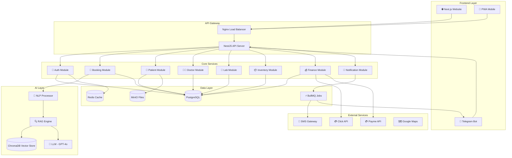
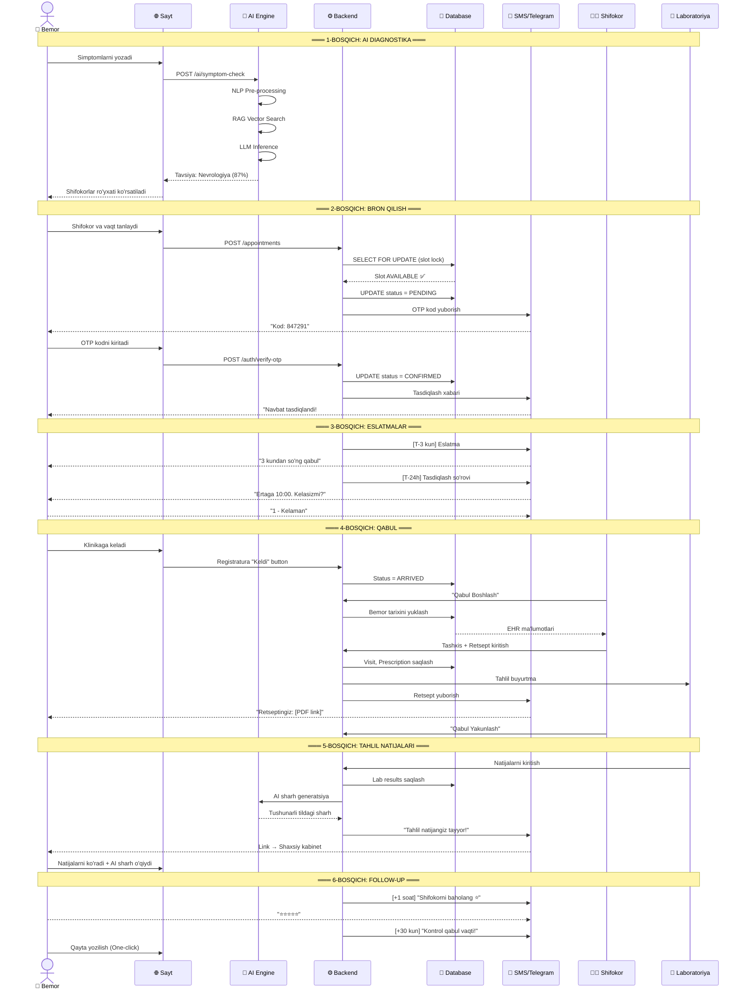
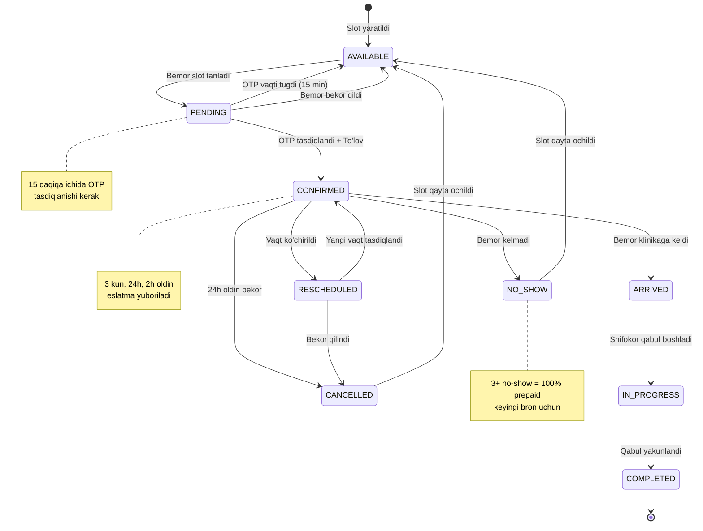
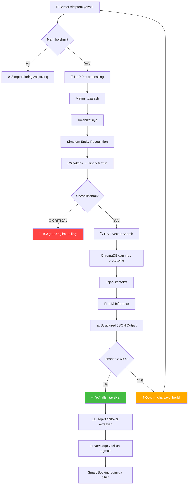
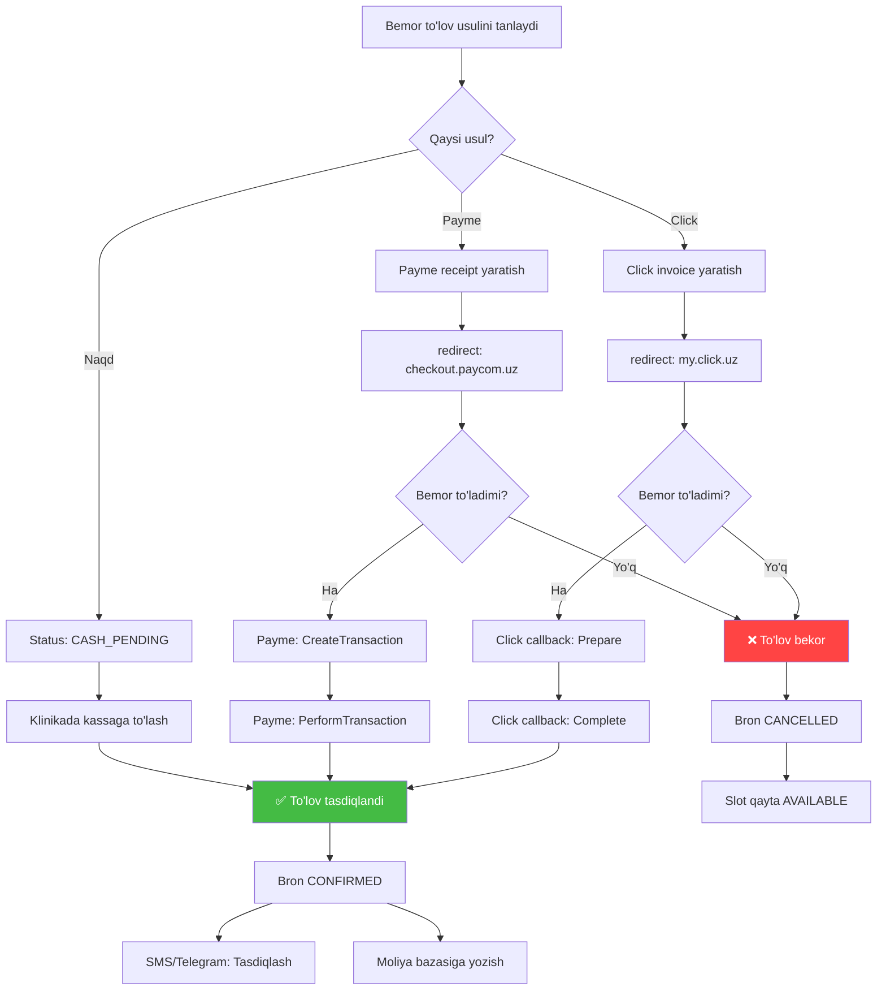
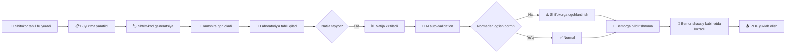
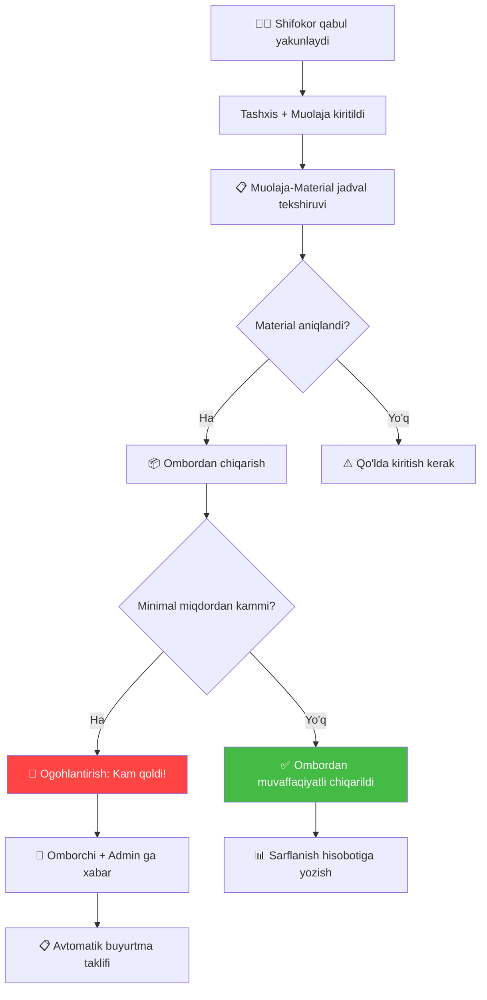
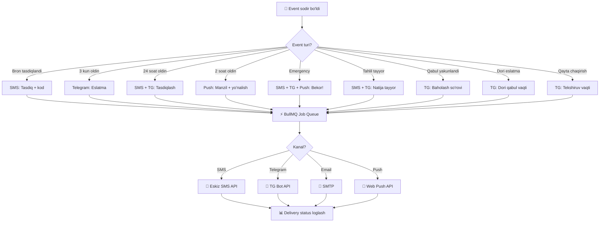
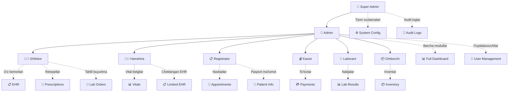
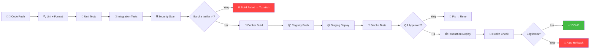

# 10. Diagrammalar va Algoritmlar To'plami

> **Format:** Mermaid Diagrammalar (GitHub da avtomatik renderlanadi)  
> **Mas'ul:** System Architect  

---

## 1.1. Tizim Umumiy Arxitektura Diagrammasi

---

## 1.2. Bemor Sayohati (Patient Journey) — Sequence Diagram

---

## 1.3. Bron Qilish State Machine

---

## 1.4. AI Diagnostika Oqimi

---

## 1.5. To'lov Oqimi

---

## 1.6. Laboratoriya Oqimi

---

## 1.7. Ombor Avtomatik Chiqarish

---

## 1.8. Bildirishnomalar Oqimi

---

## 1.9. RBAC Huquqlar Diagrammasi

---

## 1.10. Deployment Pipeline

---

*Keyingi bo'lim: [11_ROADMAP_VA_SPRINT_REJASI.md](./11_ROADMAP_VA_SPRINT_REJASI.md)*
