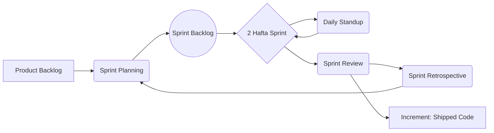

# 🏥 Med-Core Professional — Scrum Boshqaruv Tizimi (Professional Edition)

Ushbu hujjat loyihaning Scrum metodologiyasi bo'yicha eng yuqori standartlarda boshqarilishini ta'minlaydi.

---

## 🎭 1. User Personas (Foydalanuvchi Personajlari)

Tizim kim uchun qurilayotganini tushunish uchun asosiy personajlar:

| Personaj | Rol | Maqsad | Muammo |
|---|---|---|---|
| **Anora opa (45 yosh)** | Bemor | Shifokorga tez va oson navbatga yozilish. | Navbat kutish va qog'ozbozlikdan charchagan. |
| **Dr. Alisher (38 yosh)** | Shifokor | Bemorlar tarixini tez ko'rish va tashxis qo'yish. | Ma'lumotlar tarqoqligi va vaqt yetishmasligi. |
| **Malika (22 yosh)** | Registrator | Navbatlarni tartibga solish va to'lovlarni qabul qilish. | Telefon qo'ng'iroqlari juda ko'pligi. |

---

## 📋 2. Product Backlog & Acceptance Criteria

| ID | User Story | SP | Acceptance Criteria (Qabul qilish me'yorlari) |
|---|---|---|---|
| **US.1** | Bemor sifatida OTP bilan ro'yxatdan o'tish. | 5 | 1. SMS 60 soniya ichida kelishi kerak.<br>2. Telegram bot orqali OTP olish imkoniyati.<br>3. 3 marta noto'g'ri kiritilganda blokirovka. |
| **US.2** | AI Simptom Diagnostika chatboti. | 13 | 1. O'zbek tili terminlarini 90% aniqlikda tushunish.<br>2. Kamida 3 ta shifokor mutaxassisligini tavsiya qilish.<br>3. Shoshilinch holatlarda "Tez yordam" tugmasini ko'rsatish. |
| **US.3** | Shifokor EHR (Tibbiy karta) moduli. | 13 | 1. MKB-10 kodlari bo'yicha qidiruv.<br>2. Oldingi tashxislar bilan solishtirish grafigi.<br>3. Retseptni QR kod ko'rinishida generatsiya qilish. |

---

## 🔄 3. Scrum Life-cycle (Mermaid Diagram)



---

## 📅 4. Scrum Ceremonies (Marosimlar jadvali)

| Marosim | Davomiyligi | Qatnashchilar | Maqsad |
|---|---|---|---|
| **Sprint Planning** | 2-4 soat | Barcha jamoa | Kelgusi 2 hafta uchun vazifalarni tanlash. |
| **Daily Standup** | 15 min | Ishlab chiquvchilar | Bugungi reja va to'siqlarni muhokama qilish. |
| **Sprint Review** | 1-2 soat | Jamoa + Stakeholder | Bajarilgan ishni namoyish qilish (Demo). |
| **Sprint Retro** | 1-1.5 soat | Jamoa | Jarayonni qanday yaxshilashni kelishib olish. |

---

## ✅ 5. Governance: DoR va DoD

### Definition of Ready (DoR) - Vazifa tayyor:
- User story aniq yozilgan va Acceptance Criteria mavjud.
- Bog'liqliklar (dependencies) hal qilingan.
- Story Point (SP) baholangan.
- Dizayn prototipi (Figma) tayyor (UI vazifalar uchun).

### Definition of Done (DoD) - Vazifa bajarildi:
- Kod merge bo'lgan va GitHub Actions (CI/CD) o'tgan.
- Unit va Integration testlar yozilgan.
- Staging muhitida Manual QA dan o'tgan.
- Hujjatlar (README, API docs) yangilangan.

---

## 📊 6. User Story Workflow

```mermaid
kanban
  Todo
    [US.6] Lab Module Integration
    [US.7] Admin KPI Dashboard
  In Progress
    [US.2] AI Chatbot RAG Pipeline
    [SB.1.2] Database Schema Setup
  Review/QA
    [US.1] OTP Login logic
    [SB.1.4] Landing Page Design
  Done
    [SB.1.1] Project Scaffolding
```

---

*© 2026 Med-Core Professional. Scrum Maturity Level: 5/5.*
